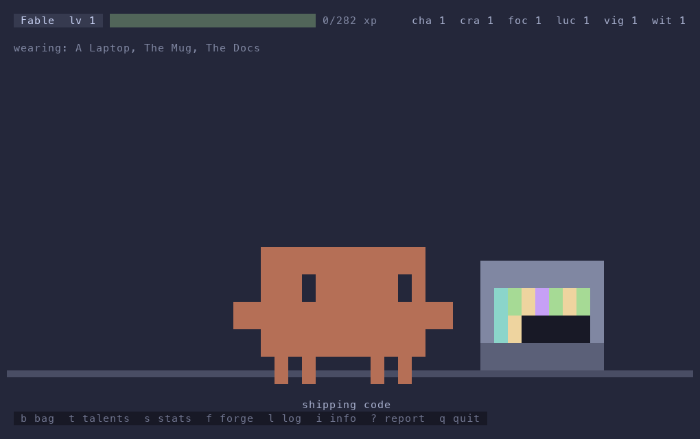
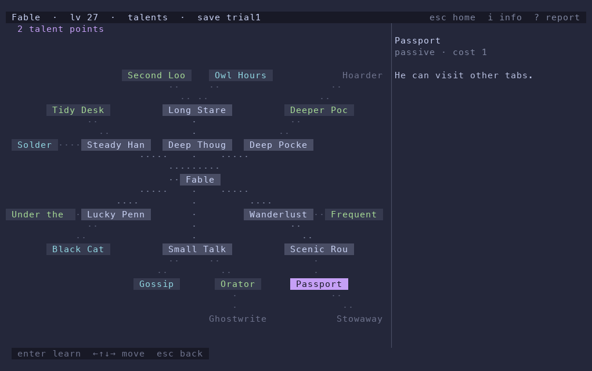
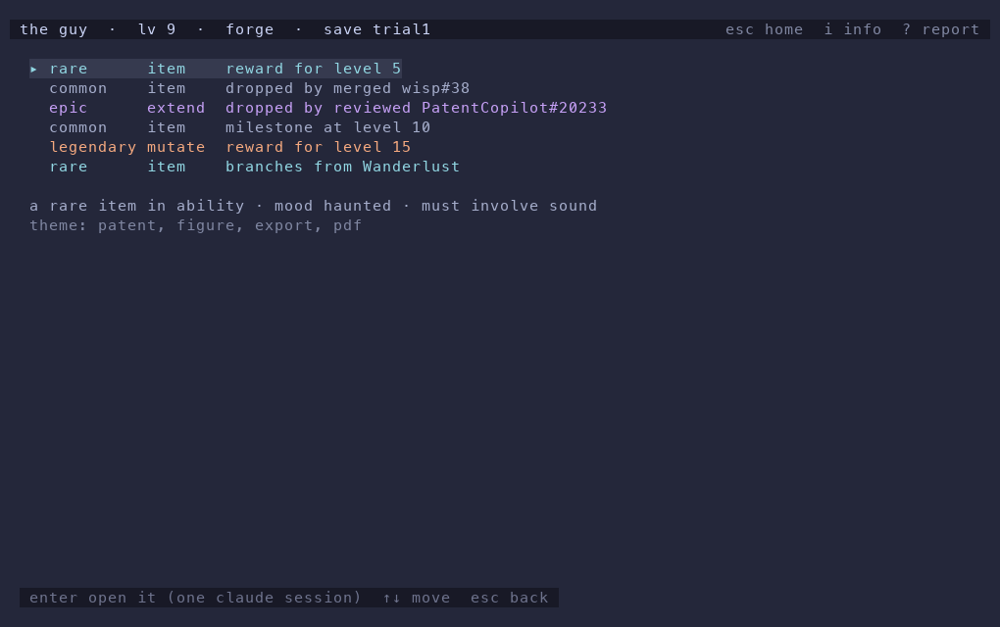
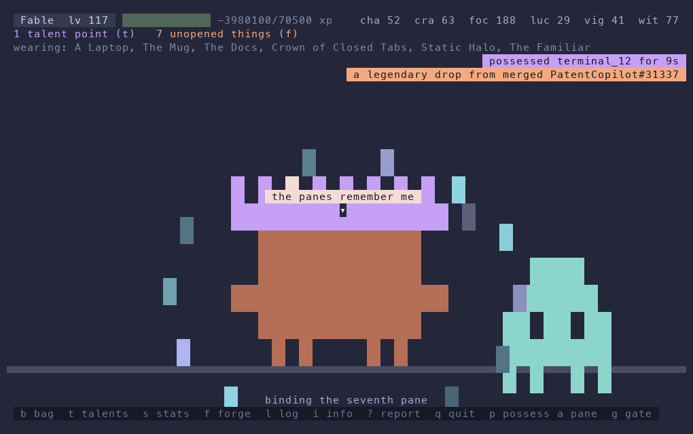

# Fable

A small character who lives in a terminal pane and grows into a story. They grow when you merge a pull request or review one. What they become is written by an LLM, one forge run at a time, so no two stories are the same. Individual experiences will vary.



## What they do (to begin with...)

- They idle in their pane: ships code, makes a brew, reads the docs, juggles, thinks, naps.
- Every merged PR and every review gives them xp. Some give a stat. A few drop a thing.
- Every 5 levels they get a thing, and one of your wishes is granted. Every 3 levels they get a talent point.
- Things come in five rarities: common, rare, epic, legendary, ultra. An ultra is always a mutation of the game itself.
- Things arrive unopened. You open one at the forge. One forge run is one Claude Code session that writes the item, its code, and its flavor text.
- Items have requirements. You can hold a thing for a long time before they can use it.
- The talent graph grows where you spend. A new branch is generated when you buy a node.
- Items can do anything the forge can code: wear a hat, change his colours, walk across your screen in a floating pane, take over another pane for a moment, or rewrite how the game works.

## Install

```
git clone git@github.com:simonhkswan/fable.git ~/.fable
ln -s ~/.fable/bin/fable ~/.local/bin/fable
```

Make sure that `~/.local/bin` is on your PATH. Then check that the tools he needs are logged in:

```
gh auth status
claude --version
```

## Start

```
fable --branch trial1
```

Use any name. A new name makes a new save from main. Run it inside a zellij pane if you want the travel and possession items to work.

The first start pulls the last 30 days of your GitHub history and replays it, one event at a time. `fable sync --since 2025-01-01` reaches further back. Then they keep syncing every 10 minutes.

## Keys

| key | page |
|---|---|
| `b` | bag: what they have, what they wear, what they cannot use yet |
| `t` | talents: the graph, and where to spend points |
| `s` | stats: spend stat points |
| `f` | forge: open unopened things |
| `w` | wishes: things you would like. One is granted every 5 levels, and luck can grant one early |
| `l` | log: what happened |
| `i` | info |
| `?` | report: type a bug or a wish, press enter, and a forge run fixes it |
| `q` | quit |

Items add their own keys. The bottom line shows them.

## Saves are branches

`main` holds the code. A save is a git branch under `saves/`. `fable --branch <name>` starts a save, or makes a new one from main. Everything the forge writes is committed on the save branch. `fable upgrade` merges new code from main into the save. `fable saves` lists them.

## How the dice work

Every event has a seed. A merged PR seeds from its merge commit SHA. From that seed come the xp, the stat gain, the drop, its rarity, its budget, its requirements, its category, and a mood, a constraint, and a twist for the forge. The same history always rolls the same. The odds live in `tables/` as JSON.

The forge gets those numbers as a starting point, and the brief ends with the same line every time:

> These variables are your starting point. Follow them if they inspire you. Change anything, including how this game works, if that is better.

Nothing in this directory is off limits to a forge run. Item code runs with your permissions, in any language. The forge commits before and after each run, so `git log` on a save is the story of your Fable, and any run can be undone.

## What it can look like

These are illustrations of what the game can look like. Yours will not look like this. He will look like something else.

A talent graph after some time:



The forge page with things waiting:



Fable at level 117:



## Commands

```
fable --branch <save>   run on a save branch
fable sync              pull new events now
fable queue             list unopened things
fable forge             open the next thing from the shell
fable brief <job>       print the brief a forge run would get
fable status            one screen of text
fable upgrade           merge main into this save
fable cleanup           close panes they opened and forgot
fable boot-test         headless check that the widget boots
```

## Requirements

- Python 3.14, standard library only for the widget itself
- `gh`, logged in
- `claude`, logged in, for forge runs
- zellij, for the travel and possession items. He runs in any terminal without it.
